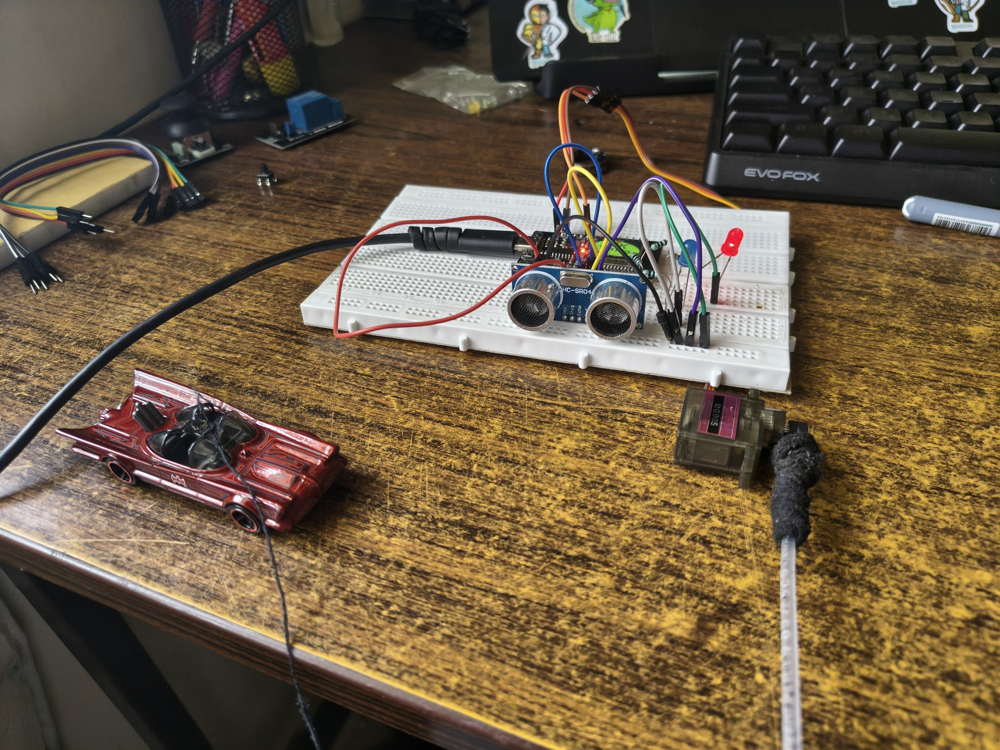
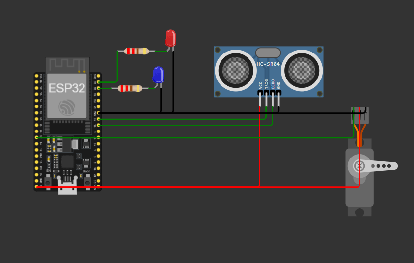
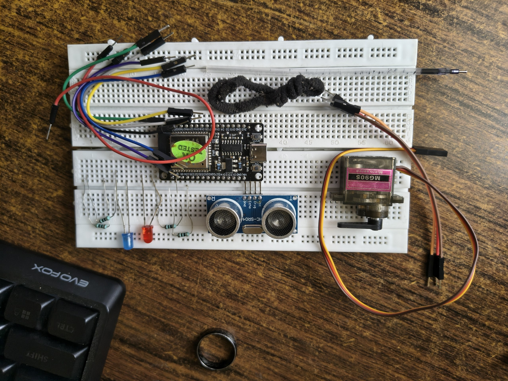

# 🚧 ESP32 Ultrasonic Barrier Controller

<p align="center">
  
</p>

<p align="center">


</p>

An embedded systems project demonstrating an **automatic barrier gate controller** using an **ESP32**, **HC-SR04 ultrasonic sensor**, and **servo motor**. The system detects an approaching object, automatically opens the barrier, and closes it after a configurable timeout using **non-blocking programming with `millis()`**.

---

# 🎥 Demo

<p align="center">
    
</p>

---

# ✨ Features

- 🚗 Automatic vehicle/object detection
- 📏 Distance measurement using HC-SR04 ultrasonic sensor
- 🚧 Automatic barrier opening
- ⏱ Barrier remains open for a configurable duration
- 🔄 Automatic barrier closing
- ⚡ Non-blocking timing using `millis()`
- 🧩 Modular firmware with reusable functions
- 🔧 Easily configurable detection distance and servo angles

---

# 🛠 Hardware Used

| Component | Quantity |
|-----------|----------|
| ESP32 DevKit V1 | 1 |
| HC-SR04 Ultrasonic Sensor | 1 |
| SG90/MG90S Servo Motor | 1 |
| Breadboard | 1 |
| Jumper Wires | Several |
| USB Cable | 1 |

---

# 🔌 Circuit Diagram

<p align="center">

</p>

---

# 🔗 Pin Connections

| ESP32 Pin | Connection |
|-----------|------------|
| GPIO18 | HC-SR04 Trigger |
| GPIO19 | HC-SR04 Echo |
| GPIO27 | Servo Signal |
| VIN (5V) | HC-SR04 VCC |
| VIN (5V) | Servo VCC* |
| GND | HC-SR04 GND |
| GND | Servo GND |

> **Note**
>
> For larger servos, an external 5V power supply is recommended instead of powering the servo directly from the ESP32.

---

# 📸 Hardware Used

<p align="center">

</p>

---

# ⚙️ How It Works

1. ESP32 initializes the ultrasonic sensor and servo motor.
2. The barrier starts in the **closed** position.
3. The HC-SR04 continuously measures the distance to nearby objects.
4. When an object is detected within the configured threshold (20 cm by default), the barrier opens.
5. A non-blocking timer starts using `millis()`.
6. The barrier remains open for the configured duration.
7. After the timeout expires, the barrier automatically closes.
8. The detection cycle repeats continuously.

---

# 🧠 Software Concepts Demonstrated

- GPIO Digital Input/Output
- Ultrasonic Sensor Interfacing
- Pulse Width Measurement using `pulseIn()`
- Servo Motor Control (PWM)
- Distance Calculation
- Embedded Timing with `millis()`
- State Management
- Modular Programming
- Embedded C++
- Arduino Framework

---

# 📂 Project Structure

```text
ESP32-Ultrasonic-Barrier-Controller
│
├── ESP32_Ultrasonic_Barrier_Controller.ino
├── README.md
│
└── assets
    ├── demo.jpg
    ├── demo.gif
    ├── circuit_diagram.jpg
    └── hardware_used.jpg
```

---

# ⚙️ Configuration

```cpp
const int trigPin = 18;
const int echoPin = 19;
const int servoPin = 27;

const float soundSpeed = 0.0343;

const int openAngle = 0;
const int closeAngle = 90;

const int detectionDistance = 20;     // cm
const int openDuration = 10000;       // ms
```

---

# 🚀 Future Improvements

- RFID Access Control
- Automatic License Plate Recognition
- IR Backup Sensor
- OLED Status Display
- Buzzer Alerts
- Traffic Light Indicators
- Wi-Fi Monitoring
- ESP32 Web Dashboard
- MQTT Integration
- IoT Parking Management System
- Vehicle Counting
- Cloud Data Logging

---

# 📚 Learning Outcomes

This project helped reinforce several important embedded systems concepts:

- Interfacing the HC-SR04 ultrasonic sensor with ESP32
- Measuring pulse duration using `pulseIn()`
- Calculating object distance using the speed of sound
- Controlling servo motors using PWM
- Implementing non-blocking timers with `millis()`
- Organizing firmware using modular functions
- Designing event-driven embedded applications
- Building a real-world embedded automation project

---

# 👨‍💻 Author

**Rahul Deb**

Electronics & Communication Engineering Undergraduate  
National Institute of Technology Manipur

GitHub: **https://github.com/imRD4Barca**

---

<p align="center">

⭐ If you found this project helpful, consider starring the repository!

</p>